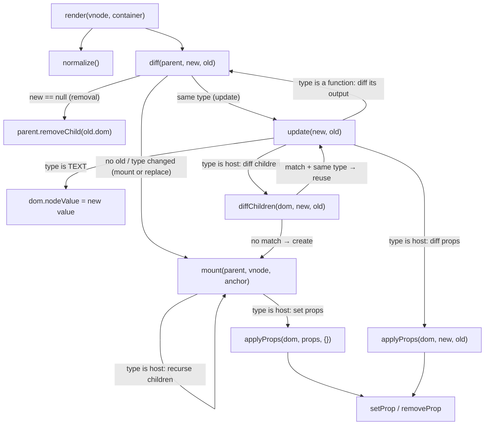
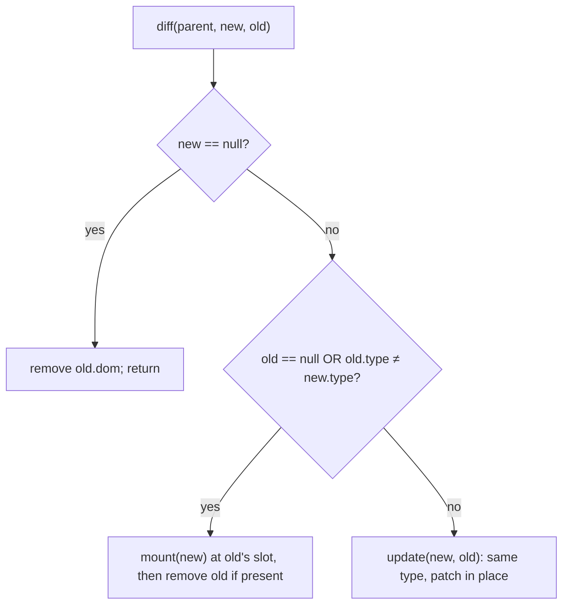
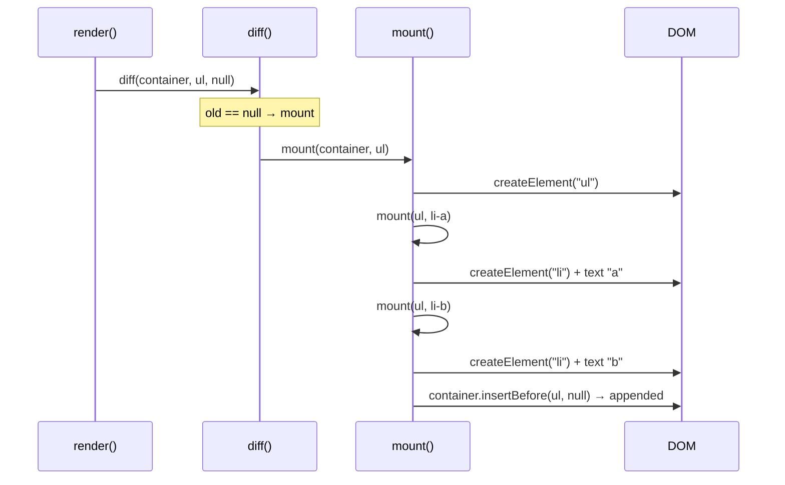
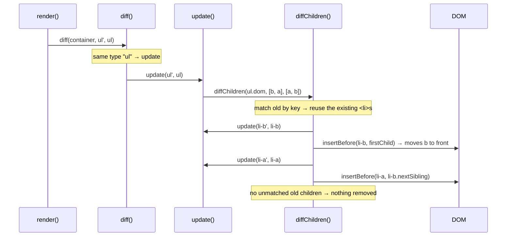

# Stage 03 — Reconciliation call flow

Companion to [`03-reconciliation.md`](03-reconciliation.md). Diagrams of how the reconciler's
functions call each other. Diagrams are Mermaid (GitHub renders them inline).

## The functions, at a glance

| Function | Job |
|----------|-----|
| `render(vnode, container)` | Entry point. Normalize the new tree, `diff` it against the tree stored on the container, then stash the new tree for next time. |
| `normalize(vnode)` | Collapse `null`/booleans → nothing and strings/numbers → a `TEXT` vnode, so everything downstream is one uniform shape. |
| `diff(parent, new, old)` | Reconcile **one slot**: decide remove / mount / replace / update. |
| `mount(parent, vnode, anchor)` | Create brand-new DOM for a vnode (recursively for children). |
| `update(new, old)` | Same type → patch the existing DOM node in place. |
| `diffChildren(parent, new, old)` | Keyed list reconciliation: match, update/move, mount, remove. |
| `applyProps` / `setProp` / `removeProp` | Add / change / remove attributes, styles, and event listeners. |

**The whole thing is mutual recursion.** The tree walk happens because
`diff → update → diffChildren → diff …` and `diff → mount → mount …` keep calling back into
each other. The recursion bottoms out at **leaves** (a `TEXT` node) and at **removals**
(`newVNode == null`).

## Who calls whom (call graph)

Notice the loops — `D → U → DC → U` and `D → U → DC → M → M` — those *are* the recursion
descending into the tree.

## The `diff` decision (one slot)

## Example 1 — first render (mount path)

Rendering `<ul><li key=a>a</li><li key=b>b</li></ul>` into an empty container:

## Example 2 — second render with a keyed reorder (update path)

Re-rendering the same list reordered to `[b, a]`. The existing `<li>` nodes are **reused and
moved**, not rebuilt:

If instead the new list were `[a]`, `diffChildren` would reuse `a`, and the cleanup loop at
the end would `removeChild(li-b.dom)` because `b` was never reused.
